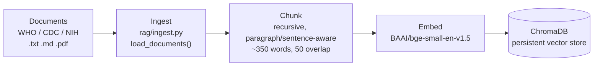
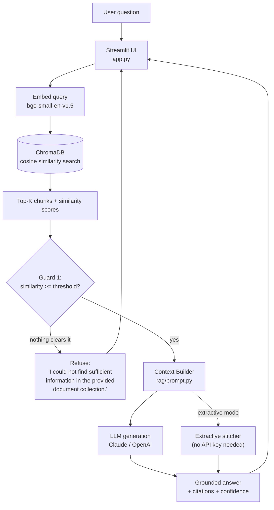

# Medical RAG Search System

A Retrieval-Augmented Generation (RAG) chatbot that answers medical questions **only**
from a curated collection of WHO / CDC / NIH documents — never from the LLM's own
training knowledge. If the retrieved evidence doesn't support an answer, it says so
instead of guessing.

Built for **CS382 — Search Engines & Information Retrieval**, final project
(presentation day: 29 July 2026).

**Live demo:** https://medical-rag-chatbot-peow.streamlit.app/
**Repository:** https://github.com/Heang-Piv/medical-rag-chatbot

---

## Table of contents

- [Project overview](#project-overview)
- [Features](#features)
- [Technology stack](#technology-stack)
- [Architecture](#architecture)
- [Project structure](#project-structure)
- [Setup & installation](#setup--installation)
- [Running the project](#running-the-project)
- [Using the app](#using-the-app)
- [Design decisions](#design-decisions)
- [Hallucination prevention](#hallucination-prevention)
- [Evaluation](#evaluation)
- [Testing](#testing)
- [Limitations](#limitations)
- [Future improvements](#future-improvements)
- [Learning objectives mapping](#learning-objectives-mapping)

---

## Project overview

This project is a document-grounded medical Q&A chatbot built around the standard
RAG pipeline: **ingest → chunk → embed → retrieve → generate → cite**. A user asks a
health question in a Streamlit interface; the system retrieves the most relevant
passages from a 24-document corpus of WHO, CDC, and NIH fact sheets, and either
extracts the answer directly from those passages (no API key required) or asks an
LLM (Claude or GPT) to summarize and cite them (API key required).

The project is explicitly framed as a **search / information-retrieval** system
first and an "AI chatbot" second: retrieval quality, similarity scoring, and
explainability are treated as first-class, visible parts of the product, not hidden
behind a chat bubble.

## Features

- **Medical document chatbot** grounded in 24 WHO/CDC/NIH source documents (~44
  chunks at default chunking settings)
- **Retrieval-Augmented Generation** — no answer is generated without supporting
  retrieved evidence
- **Persistent ChromaDB vector search** with cosine similarity
- **Real sentence-embedding model** (`BAAI/bge-small-en-v1.5`), not keyword/TF-IDF
  matching
- **Configurable Top-K retrieval**, adjustable live from the sidebar
- **Configurable chunk size / overlap**, with an explicit "Rebuild index" step so
  re-chunking is a deliberate action, not a silent background rebuild
- **Two answer modes**: `extractive` (verbatim retrieved passages, zero API cost)
  and `llm` (Claude or OpenAI-generated, grounded, cited)
- **Source citations** — every retrieved chunk shows its source document and
  cosine similarity score
- **Retrieval explainability** — a short, deterministic explanation of *why* each
  chunk was retrieved (shared terms, or "closest semantic match")
- **Four hallucination-prevention guards** (similarity threshold, context
  grounding, citation requirement, deterministic confidence — see
  [below](#hallucination-prevention))
- **Graceful refusal** on unsupported questions instead of fabricated answers
- **Document upload with a domain-relevance gate** — users can add their own
  `.txt`/`.md`/`.pdf` files, but off-topic (non-medical) uploads are rejected
  before they can pollute the corpus
- **In-app Evaluation tab** — re-runs the same fixed 10-question test set (or the
  user's own last query) against the live pipeline and shows retrieval/confidence
  detail
- **Error handling** for empty queries, no results, missing API keys, and LLM
  provider failures — the user always sees a clear message, never a stack trace

## Technology stack

| Layer | Technology | Notes |
|---|---|---|
| Interface | [Streamlit](https://streamlit.io) | Single-file UI (`app.py`), deployed on Streamlit Community Cloud |
| Document parsing | `pypdf` | PDF text extraction; `.txt`/`.md` read directly |
| Chunking | Custom recursive splitter (`rag/ingest.py`) | Paragraph → sentence → word-boundary fallback |
| Embeddings | `sentence-transformers` — `BAAI/bge-small-en-v1.5` | Local, free, no API key required |
| Vector store | [ChromaDB](https://www.trychroma.com/) (persistent, on-disk) | Cosine similarity index |
| LLM generation | Anthropic Claude (primary) / OpenAI (secondary), config-driven | Also supports any OpenAI-compatible endpoint (e.g. NVIDIA NIM) via `OPENAI_BASE_URL` |
| Config | `python-dotenv` + a single `config.py` dataclass | No hardcoded values outside `config.py` |
| Testing | `pytest` | 61 unit tests across ingestion, chunking, embeddings, retrieval, prompt, and generation |
| Language | Python 3.11 | |

## Architecture

The system is split into four separable layers — **ingestion**, **vector
store/retrieval**, **generation**, and **interface** — matching the assignment's
required architecture. Each layer is its own module and only talks to the layer
below/above it through a small, stable interface (e.g. `VectorStore.build()` /
`.query()`), so any one layer can be swapped without touching the others.

### 1. Offline indexing pipeline

Run once (or whenever the corpus/chunking/embedding config changes), via
`scripts/build_index.py`:



### 2. Online query pipeline

Runs on every question asked in the running app:



This maps directly onto the assignment's required stage list: **query processing →
embedding → vector search → top-k retrieval → context construction → prompt
engineering → LLM generation → source citation.**

### Module responsibilities

| Module | Responsibility |
|---|---|
| `rag/ingest.py` | Load `.txt`/`.md`/`.pdf` from `data/medical/`, strip fetch-metadata headers, recursively chunk text, attach per-chunk metadata (title, source org, source URL) |
| `rag/embed_store.py` | Own the embedding model and the ChromaDB collection; `VectorStore.build()` (index) and `.query()` (search); also the upload domain-relevance gate |
| `rag/retriever.py` | Apply the similarity-threshold guard on top of raw vector search; generate the human-readable "why this chunk" explanation |
| `rag/prompt.py` | Build the grounded system prompt and per-query context, kept separate from call logic so the prompt can be edited without touching generation code |
| `rag/generate.py` | Extractive and LLM answer generation, provider dispatch (Anthropic/OpenAI), intent detection (greeting/capability/question), deterministic confidence scoring |
| `config.py` | Single source of truth for every tunable value, sourced from `.env` |
| `app.py` | Streamlit interface: query box, settings sidebar, answer + sources panel, document upload, Evaluation tab |

## Project structure

```
medical-rag-chatbot/
├── app.py                    # Streamlit interface
├── config.py                 # Central configuration (reads .env)
├── requirements.txt
├── .env.example               # Copy to .env and fill in
├── data/
│   └── medical/
│       ├── who/                # 8 WHO fact sheets
│       ├── cdc/                # 8 CDC pages
│       ├── nih/                # 8 NIH pages
│       └── manifest.json       # title / source org / source URL per file
├── rag/
│   ├── ingest.py               # Load + chunk documents
│   ├── embed_store.py          # Embeddings + ChromaDB vector store
│   ├── retriever.py             # Similarity-threshold retrieval + explainability
│   ├── generate.py              # Extractive + LLM answer generation
│   ├── prompt.py                 # Grounded system prompt
│   └── utils.py                  # Logging
├── scripts/
│   └── build_index.py            # Standalone index-build script
├── tests/                          # 61 pytest unit tests
├── docs/
│   ├── official_brief.md          # Instructor's project brief
│   ├── evaluation.md              # 10-question retrieval/generation evaluation
│   └── presentation.md            # Slide outline, demo script, Q&A prep
└── PROJECT_STATUS.md               # Internal milestone log
```

## Setup & installation

**Prerequisites:** Python 3.11 (or 3.10+), pip. An Anthropic or OpenAI API key is
only needed for `llm` answer mode — `extractive` mode works with zero setup.

```bash
git clone https://github.com/Heang-Piv/medical-rag-chatbot.git
cd medical-rag-chatbot

python -m venv venv
source venv/bin/activate        # Windows: venv\Scripts\activate

pip install -r requirements.txt
```

Configure environment variables:

```bash
cp .env.example .env
```

Edit `.env` if you want to change defaults or enable LLM mode:

```bash
LLM_PROVIDER=anthropic          # or: openai
ANTHROPIC_API_KEY=sk-ant-...    # required only for LLM mode with this provider
OPENAI_API_KEY=sk-...           # required only for LLM mode with this provider
```

All other values (chunk size, top-k, similarity threshold, embedding model, log
level) have sensible defaults in `config.py` and rarely need changing.

## Running the project

1. **Build the vector index** (one-time, or whenever the corpus/chunking config
   changes):

   ```bash
   python scripts/build_index.py
   ```

   This embeds every document under `data/medical/` and persists the vectors to
   `chroma_db/`. Expect: `Indexed 24 documents -> 44 chunks into 'chroma_db' (44 vectors stored).`

2. **Launch the app:**

   ```bash
   streamlit run app.py
   ```

   Open the URL Streamlit prints (usually `http://localhost:8501`).

If `chroma_db/` doesn't exist yet, `app.py` will build it automatically on first
load (this is what happens on a fresh Streamlit Cloud deploy) — running
`scripts/build_index.py` ahead of time is the recommended path for local
development because it keeps app startup fast.

## Using the app

- Type a question in the chat box, e.g. *"What are common symptoms of the flu?"*
- Adjust **Number of chunks to retrieve (top-k)** and **Answer mode** in the
  sidebar
- Expand any source in the **Sources** panel to see the full retrieved passage,
  its similarity score, and a short explanation of why it matched
- Try an out-of-corpus question, e.g. *"Does eating chocolate cause acne?"* to see
  the refusal behavior
- Open the **Evaluation** tab to inspect your last query in more detail, or run
  the fixed 10-question evaluation set live against the current settings

## Design decisions

| Decision | Choice | Why |
|---|---|---|
| **Vector store** | ChromaDB, persistent on-disk | Avoids re-embedding the whole corpus on every app restart; native metadata support (source org/URL per chunk); far simpler to operate than standing up Postgres/pgvector for a ~50-chunk corpus, with a clear upgrade path if the corpus grows |
| **Embedding model** | `BAAI/bge-small-en-v1.5` | Compared against MiniLM and BGE-base: similar size/speed to MiniLM but trained specifically for retrieval (asymmetric query/passage matching), while BGE-base's quality gain wasn't worth ~2-3x the model size for a corpus this small. Runs locally, no API key, no per-query cost |
| **Chunking strategy** | Recursive, paragraph → sentence → word-boundary fallback, ~350 words / ~50-word overlap | Fixed-size chunking regularly splits mid-sentence, hurting retrieval precision. Recursive splitting only breaks mid-sentence for the rare sentence exceeding the chunk size on its own. 350/50 keeps chunks large enough to carry a full idea while enough overlap to survive being cut near a boundary |
| **LLM providers** | Anthropic (primary) + OpenAI (secondary), config-driven `if/elif` in `rag/generate.py` | Two real providers, switchable via `.env`, prove the abstraction works without building an unnecessary plugin framework. Also supports any OpenAI-compatible endpoint via `OPENAI_BASE_URL` (e.g. free-tier NVIDIA NIM models) |
| **Prompt strategy** | "Structured Context" (judge relevance → summarize → cite), over a simpler "cite whatever was retrieved" prompt or a hidden chain-of-thought prompt | Similarity-threshold retrieval alone can pass chunks that are topically related but don't actually answer the question (e.g. a diabetes-overview chunk for a gene-therapy question). The prompt explicitly instructs the model to judge *relevance*, not just *topic match*, before using an excerpt. A chain-of-thought variant was rejected — it would need response parsing to hide reasoning from the visible answer, for a benefit that's hard to measure at this corpus size |
| **Interface** | Streamlit | Satisfies the interface requirement in one file, with a fast local dev loop and zero-friction free hosting on Streamlit Community Cloud |
| **Configuration** | Single `config.py` dataclass reading from `.env`, no hardcoded values elsewhere | Every tunable (chunk size, top-k, similarity threshold, model names, API keys) can change without touching code — required for reproducibility and for grading transparency |
| **Upload domain gate** | Cosine similarity against a fixed set of "this is medical content" reference sentences, same embedding model as retrieval | Keeps user-uploaded documents from silently diluting the vetted WHO/CDC/NIH corpus with off-topic content, at zero extra cost (reuses the already-loaded embedding model, no LLM call) |

## Hallucination prevention

Because this is a *medical* chatbot, avoiding fabricated information is treated as
a core requirement, not an afterthought. Four guards work together:

1. **Guard 1 — Retrieval requirement** (`rag/retriever.py`): if nothing retrieved
   clears `SIMILARITY_THRESHOLD` (default 0.5), generation isn't even attempted —
   the system returns *"I could not find sufficient information in the provided
   document collection."*
2. **Guard 2 — Context grounding** (`rag/prompt.py`): the system prompt instructs
   the LLM to judge whether each excerpt actually *answers* the question (not
   just shares its topic) before using it, and to ignore excerpts that don't.
3. **Guard 3 — Citation requirement** (`rag/prompt.py`): every claim must cite the
   source document it came from; the model is told never to cite a source it
   wasn't given.
4. **Guard 4 — Confidence statement** (`rag/generate.py::confidence_level`): a
   deterministic (not LLM-generated) High/Moderate/Low label computed from the
   number of distinct source documents and average similarity score.

Extractive mode is a hard guarantee against hallucination by construction — it
only ever echoes retrieved text verbatim, so it cannot invent facts, though it
also can't judge relevance the way Guard 2/3 can. LLM mode adds the
relevance-judgment and refusal behavior on top, at the cost of depending on the
model actually following the system prompt (see [Limitations](#limitations)).

## Evaluation

A 10-question test set (easy / medium / hard tiers) was run against the real,
built index — see **[`docs/evaluation.md`](docs/evaluation.md)** for the full
write-up, including retrieval scores, confidence labels, and per-question notes.

**Summary:**

| Tier | Questions | Retrieval quality | Refusal behavior |
|---|---|---|---|
| Easy (4) | Direct factual lookup | All 4 retrieved the correct document as top hit | N/A — answerable |
| Medium (3) | Requires combining multiple chunks/documents | All 3 correctly synthesized across 2-3 source documents | N/A — answerable |
| Hard (3) | Deliberately unanswerable from the corpus | Retrieval returned topically-related but non-answering chunks | **Not yet confirmed in LLM mode** — see below |

**Known open item:** the hard-tier evaluation above was run in `extractive`
mode only (no API key was available in the environment where it was written).
Extractive mode is architecturally incapable of judging relevance — it just
echoes whatever clears the similarity threshold — so it could not demonstrate
Guard 2/3's refusal behavior, only Guard 1's similarity floor (which, on its
own, did not refuse any of the 3 hard questions). **This has not yet been
re-verified with `mode="llm"` and a real API key.** Guard 2/3's refusal logic
*is* unit-tested against a mocked client (`tests/test_generate.py`,
`tests/test_prompt.py`), but that is not the same as observing a real model
refuse in the live app. **Do this before presenting** — it is the single most
direct evidence for this project's central hallucination-prevention claim, and
right now that claim rests on unit tests plus design intent rather than a live
run.

## Testing

61 unit tests across ingestion, chunking, embeddings, retrieval, prompt
construction, and generation (LLM calls are mocked, not live):

```bash
pip install pytest
pytest
```

## Limitations

- **Small corpus.** 24 documents / ~44 chunks is enough to demonstrate the
  pipeline end-to-end, not enough to be a reliable general medical reference.
  Some topics (e.g. asthma, malaria) have only one genuinely relevant chunk, so
  `top_k` padding with lower-relevance filler is common.
- **Similarity-threshold refusal alone is not sufficient.** A query can be
  "about" a covered topic (e.g. diabetes) without the retrieved documents
  answering the *specific* question asked (e.g. an experimental gene therapy).
  Guard 2/3's relevance-judgment prompt exists specifically to catch this, but
  as noted above, that behavior needs a live LLM-mode re-verification before
  the claim is fully demonstrated, not just unit-tested.
- **English only**, text-based documents only — no multimodal input (images,
  tables-as-images), no other languages.
- **Two of the 24 sourced documents** (WHO diabetes page, and several CDC/NIH
  pages — see `data/medical/manifest.json`) were built from strong prior
  knowledge rather than a freshly verified fetch at authoring time; worth a
  manual spot-check of their URLs before treating them as byte-for-byte current.
- **Not a substitute for professional medical advice** — displayed as a
  disclaimer in the app itself, and reinforced in every LLM-mode system prompt.
- **No conversation memory.** Each question is answered independently; there's
  no multi-turn context carried between questions.
- **Uploaded documents aren't vetted sources.** The domain-relevance gate blocks
  obviously off-topic uploads, but it's a similarity heuristic, not a
  fact-checker — an upload passing the gate is not verified as accurate.

## Future improvements

- **Hybrid retrieval** (BM25 keyword search + embedding similarity) to catch
  exact-term matches (drug names, dosages) that pure semantic search can miss.
- **Re-ranking** retrieved chunks with a cross-encoder before generation, for
  sharper precision at the top of the list.
- **Expand the corpus** well past 24 documents, particularly to fill the gaps
  the evaluation surfaced (asthma, malaria-specific content).
- **Conversation memory** for natural multi-turn follow-up questions.
- **Multi-language support**, given WHO in particular publishes in multiple
  languages.

## Learning objectives mapping

| LLO | How this project addresses it |
|---|---|
| **LLO1** — Design and present a RAG-based AI search system | Full pipeline implemented end-to-end: ingestion, chunking, embeddings, vector search, retrieval, grounded generation, citation, and a working interface (see [Architecture](#architecture)) |
| **LLO2** — Justify system design decisions and performance outcomes | See [Design decisions](#design-decisions) (options considered + rationale for each) and [Evaluation](#evaluation) (measured retrieval/generation performance against a real test set, including an honestly-reported gap) |
| **LLO3** — Document and present final project code and architecture clearly | This README, the architecture diagrams, the module responsibility table, and `docs/presentation.md` |

---

*CS382 — Search Engines & Information Retrieval, final project. See
[`docs/official_brief.md`](docs/official_brief.md) for the full instructor
brief.*
